## LEMP STACK IMPLEMENTATION

Connecting to EC2 using GitBash

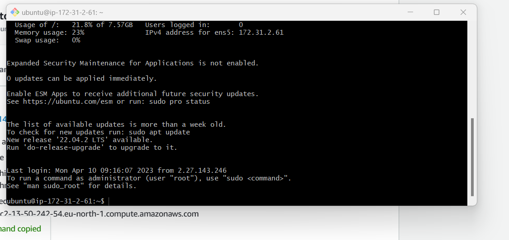

#### Step 1

*Installing the NGINX Web Server*.

 `sudo apt update`.

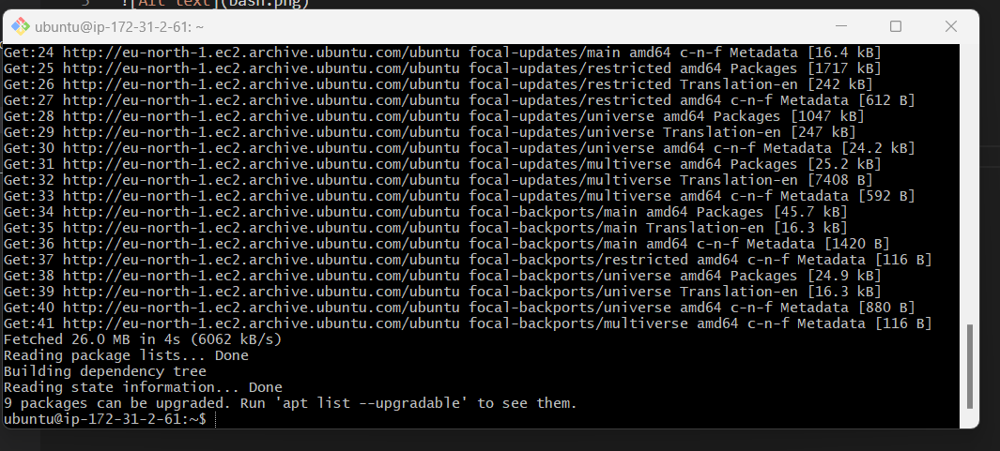
 
 `sudo apt install nginx`.

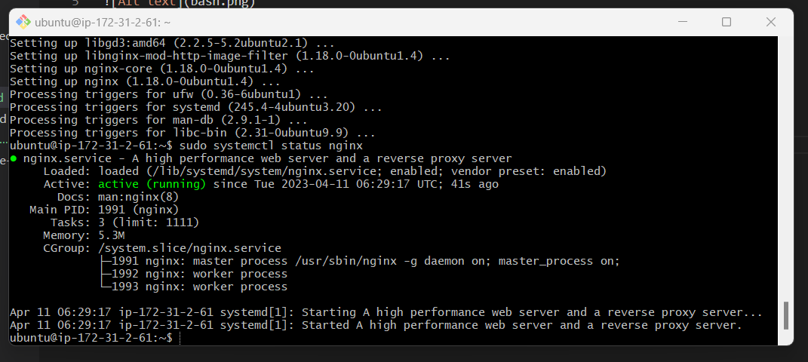

*Enabling Firewall*.

`sudo ufw allow 'Nginx HTTP'`.

`sudo ufw allow 'Nginx OpenSSH'`.

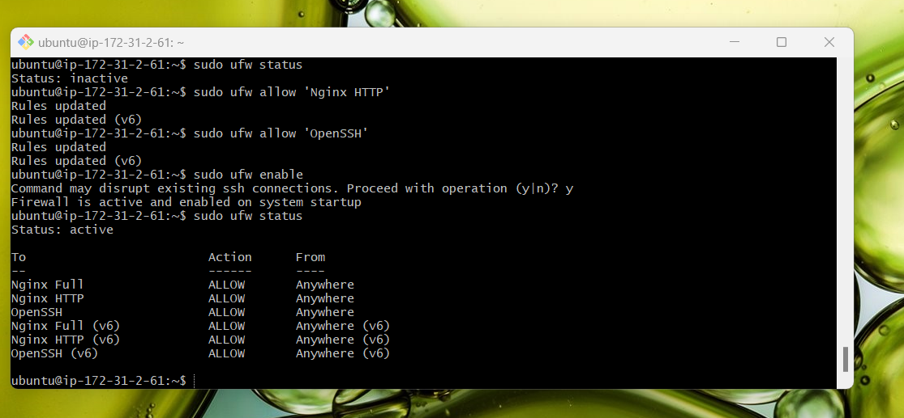

Retrive Public IP

`curl -s http//:// 169.254.169.254 /latest/meta-data/ public-ipv4'`.

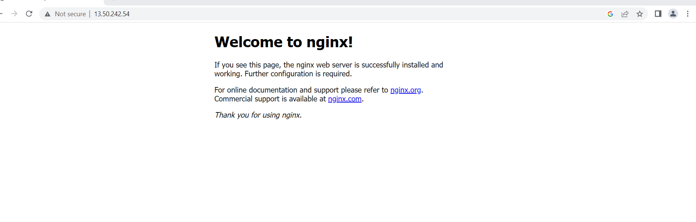

#### Step 2

*Installing MYSQL*.

`sudo apt install mysql-server`.

`sudo mysql`.

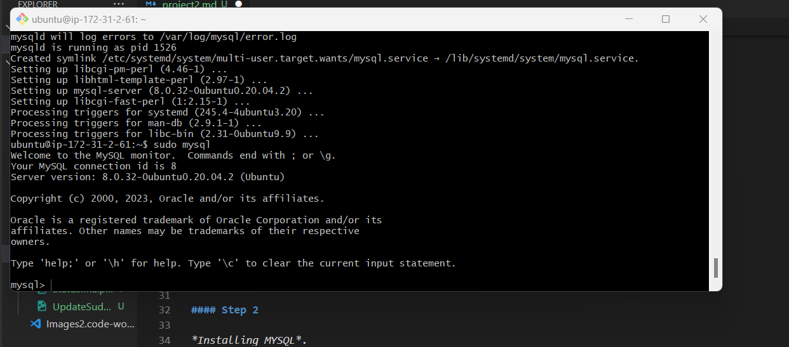

*Removing insecure default settings and lock down access to database system*.

`ALTER USER 'root'@'localhost' IDENTIFIED WITH mysql_native_password BY 'PassWord.1';`.

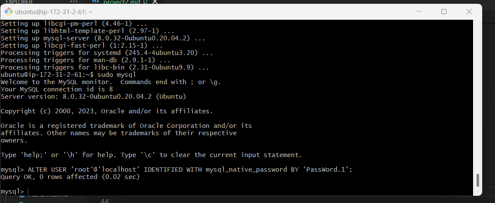

*Exit Mysql*.

`exit`.

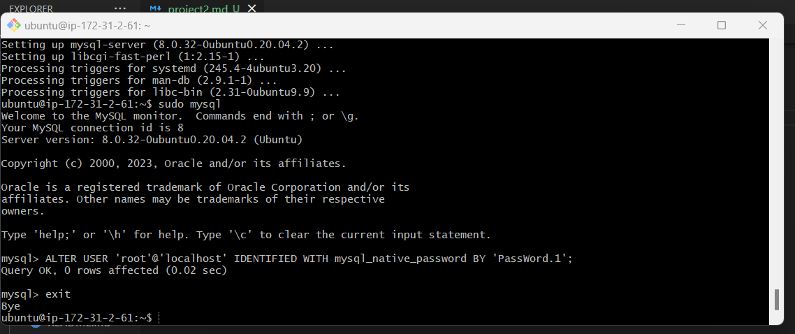

*Running interactive scripting*.

`sudo mysql_secure_installation`.

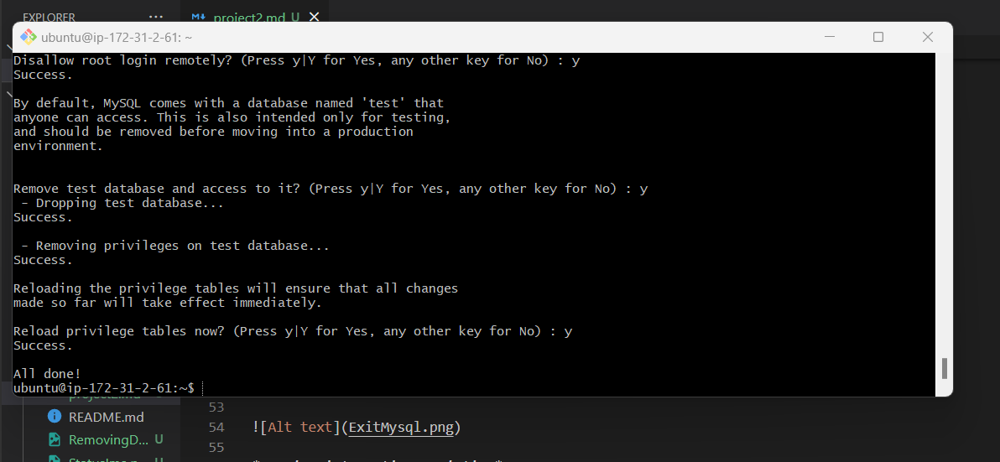

*Testing Login to Mysql*.

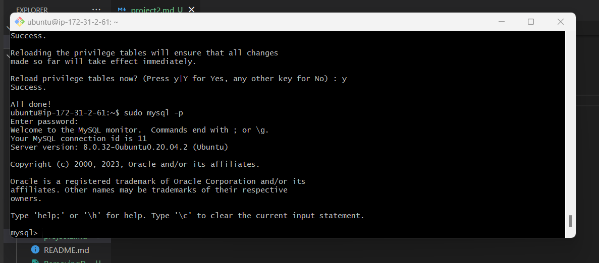

#### Step 3

*Installing PHP*.

*Installing php-fpm and php-mysql*.

`sudo apt install php-fpm php-mysql`.

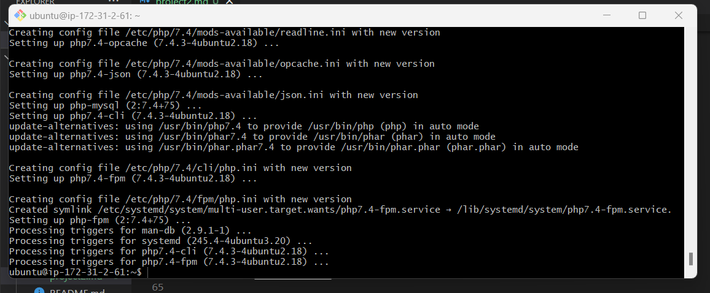

#### Step 4

*Configuring NGINX to use PHP processor*.

*Creating root web directory*.

`sudo mkdir /var/www/projectLEMP`.

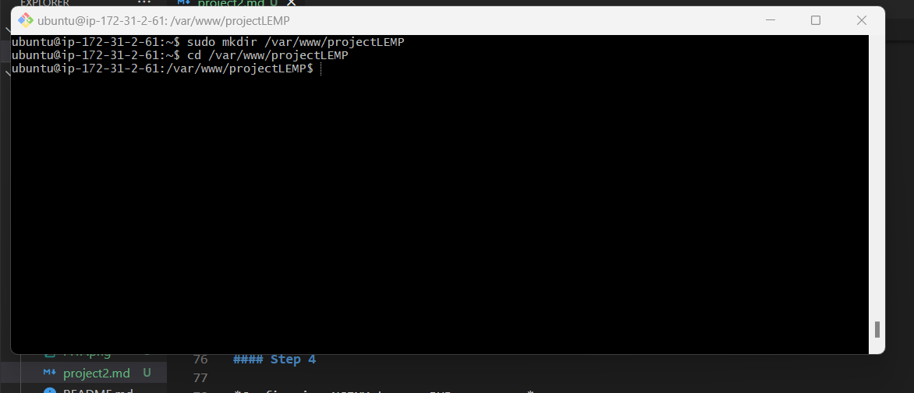

*Assiging ownership of directory with $USER environment variable*.

`sudo chown -R $USER:$USER /var/www/projectLEMP`.

*Opening new configuration file in Nginx's sits-available directory*.

`sudo nano /etc/nginx/sites-available/projectLEMP`.

*Activate configuration*.

`sudo ln -s /etc/nginx/sites-available/projectLEMP /etc/nginx/sites-enabled/`.

*Testing configuration*.

`sudo nginx -t`.

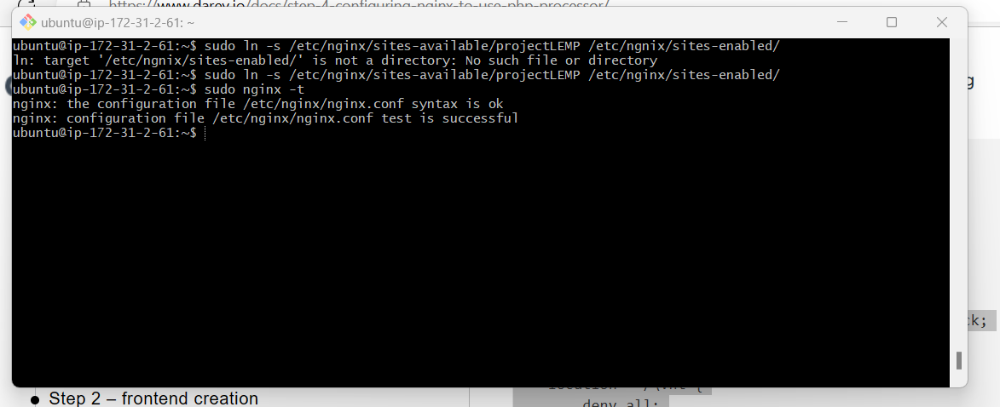

`sudo systemctl reload nginx`.

*Create an index.html file*.

`sudo echo 'Hello LEMP from hostname' $(curl -s http://169.254.169.254/latest/meta-data/public-hostname) 'with public IP' $(curl -s http://169.254.169.254/latest/meta-data/public-ipv4) > /var/www/projectLEMP/index.html`.

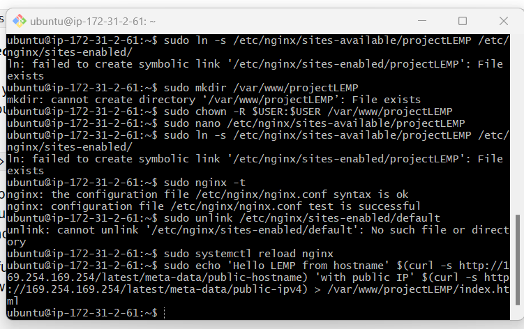

#### Step 5

*Testing PHP with Nginx*.

*creating a test PHP file in your document root*

`sudo nano /var/www/projectLEMP/info.php`.

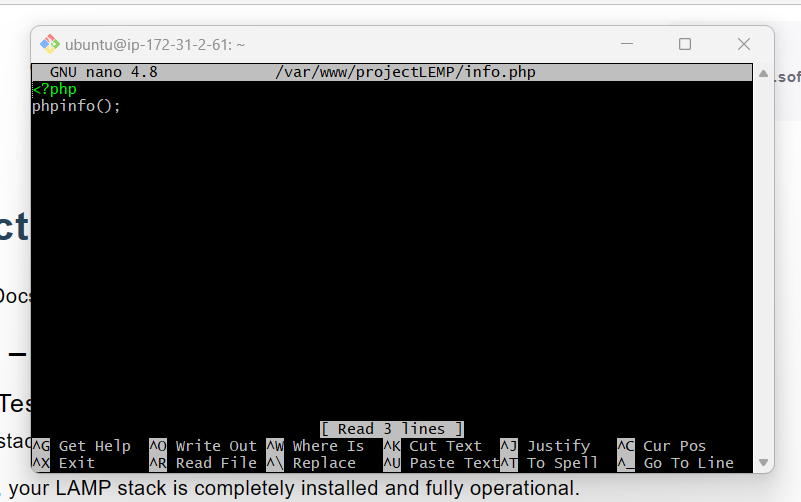

#### Step 6

*Retrieving data from MySQL database with PHP*.

*Connecting to Mysql*

`sudo mysql`.

*Create a new database*

`CREATE DATABASE `example_database`;`.

`CREATE USER 'example_user'@'%' IDENTIFIED WITH mysql_native_password BY 'password';`.

`GRANT ALL ON example_database.* TO 'example_user'@'%';`.

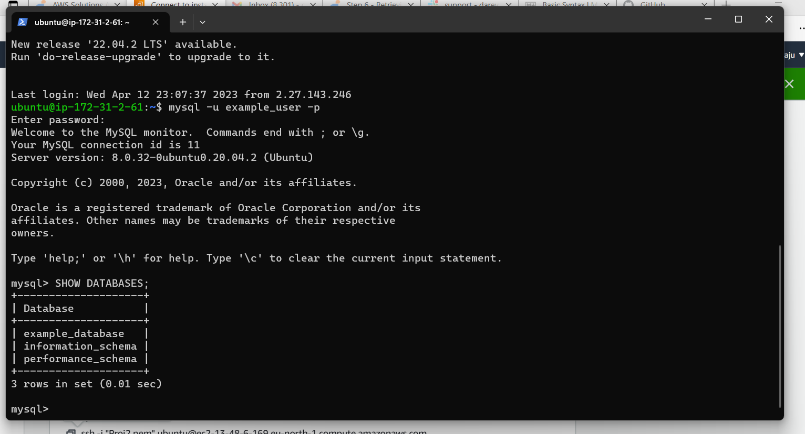

`SHOW DATABASES;`.

`CREATE TABLE example_database.todo_list (
>     item_id INT AUTO_INCREMENT,
>     content VARCHAR(255),
>     PRIMARY KEY(item_id)
 );`.

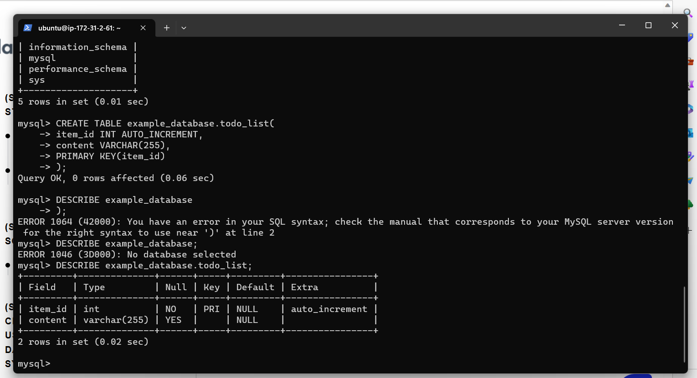

`INSERT INTO example_database.todo_list (content) VALUES ("My first important item");`.

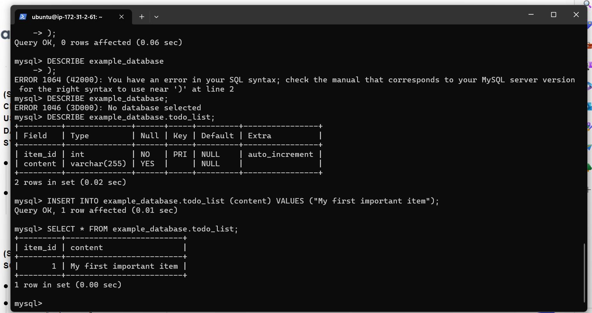